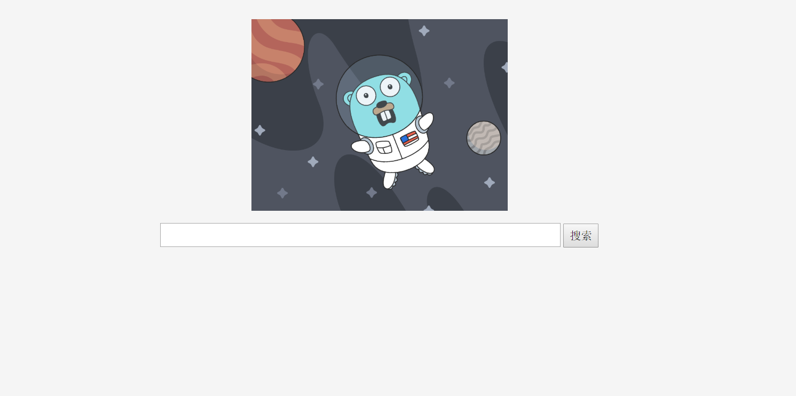
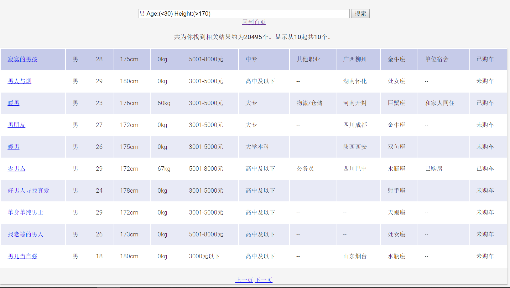
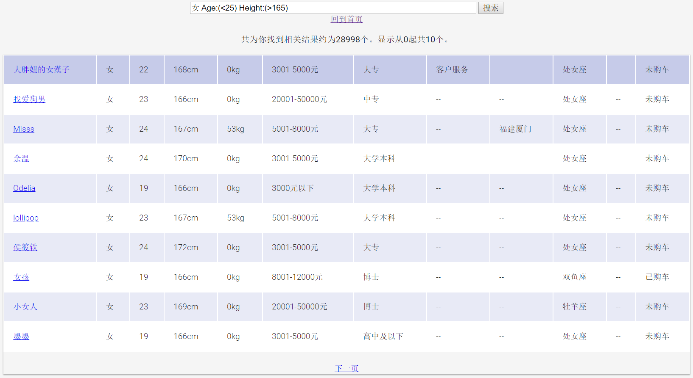
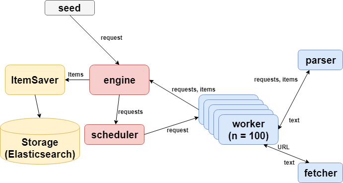

# Dating Website Crawler

This is a practice project I did when learning golang. It crawls user profiles from a dating website in a non-login mode.

## Highlight Features

- High Concurrency with goroutines
- Extensible to websites of the same type
- A simple display of crawled data using Elasticsearch

There is a distributed version of this project. For details, please refer to [it](https://github.com/Victor515/rpc-crawler).

## Project Preview

## App Architecture 

